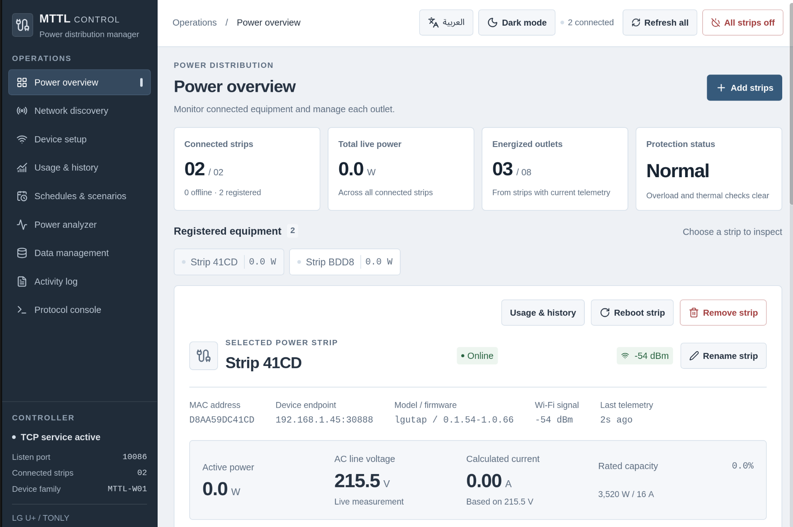

# MTTL Control

A desktop app for controlling LG U+ / TONLY MTTL-W01 smart power strips on your local network. Built with Rust, Tauri 2, React, and TypeScript. Licensed under [MIT](LICENSE).

The app receives telemetry directly from the strips and stores it in a local SQLite database. It does not require a cloud account. This is an independent project, unaffiliated with LG U+ or TONLY.

**0.0.1 Alpha 3** (`v0.0.1-alpha.3`) is a Windows-only update with guided strip setup and native Wi-Fi discovery. The first alpha remains available for Linux and macOS. Expect rough edges; platform and hardware limitations are listed below.



## What it does

- Control four outlets per strip, rename equipment, and inspect reported protection faults.
- Discover devices and set up one or several strips. Automatic Wi-Fi switching uses Linux NetworkManager; manual setup is available on other desktop platforms.
- Browse power, temperature, and recorded energy history; compare outlets and export readings to CSV.
- Create schedules, timed outlet sequences, and monitoring rules with optional shutoff.
- Inspect activity and protocol traffic, manage stored data, and restore removed strips.
- Switch between Arabic and English, with RTL layout and light or dark themes. Fonts are bundled locally.

Compatibility is based on reverse engineering the MTTL-W01 family, including firmware `0.1.54-1.0.66`. Other firmware and custom controller ports may behave differently. The [protocol guide](MTTL_CONTROLLER_PROTOCOL_GUIDE.md) distinguishes verified behavior from unknown fields.

## Install

Download an installer from [GitHub Releases](https://github.com/AmrEmad0/MTTL-W01_APP/releases). The first release is marked **Pre-release** and is titled **MTTL Control 0.0.1 Alpha**. Choose the file for your system:

| System              | Installer                                                   |
| ------------------- | ----------------------------------------------------------- |
| Linux x64           | `.deb` for Debian/Ubuntu, `.rpm` for Fedora, or `.AppImage` |
| Windows x64         | `-setup.exe` or `.msi`                                      |
| macOS Apple Silicon | `darwin_aarch64.dmg`                                        |
| macOS Intel         | `darwin_x64.dmg`                                            |

On Linux, install the package with your package manager, or make the AppImage executable and run it. WebKitGTK 4.1 is required; AppImages also need compatible system libraries. On Windows, run the installer; it downloads WebView2 if needed. On macOS, mount the DMG and drag **MTTL Control** into **Applications**.

The first Windows installers are unsigned, and macOS downloads use ad-hoc signatures without Apple notarization. Windows may show an unknown-publisher prompt. After attempting to open the macOS app, approve it in **System Settings → Privacy & Security → Open Anyway** if you trust the download; see [Apple's instructions](https://support.apple.com/en-us/102445). Do not disable system-wide protection. Release assets include `SHA256SUMS.txt` to verify downloads.

Linux is the primary development platform. The release workflow builds all listed platforms and runs their Rust checks; Windows and macOS hardware operation and native interface behavior still need hands-on verification. Automatic provisioning requires `nmcli` and a NetworkManager-managed Wi-Fi adapter on Linux; use manual device setup on Windows and macOS.

Windows Wi-Fi discovery uses the native WLAN API. Enable Wi-Fi and the WLAN AutoConfig service. If Windows denies scanning, enable Location services and app location access under **Settings > Privacy & security > Location**, then click **Scan Wi-Fi** again. To add a strip on Windows: enter the destination Wi-Fi credentials and this computer's IPv4 address on that network, choose the strip, and join its setup Wi-Fi using the displayed password. Select **I am connected — send settings**. After the strip accepts the settings, reconnect the computer to the destination Wi-Fi and select **I reconnected — check connection**. If you are already connected to the strip, choose **Already connected? Continue without scanning**. Keep the destination controller IPv4 address unchanged while joining the strip's temporary network.

## Build and run

Install these prerequisites:

- Rust **1.99.0**, including Clippy and rustfmt. [rustup](https://rustup.rs/) reads the pinned [rust-toolchain.toml](rust-toolchain.toml).
- Bun **1.4.2** and Node.js **22.12 or newer**. Bun installs dependencies and runs tests; Node runs the frontend tooling.
- Your platform's [Tauri prerequisites](https://v2.tauri.app/start/prerequisites/): WebKitGTK 4.1 and development libraries on Linux, Xcode command line tools on macOS, or Microsoft C++ Build Tools and WebView2 on Windows.

```sh
git clone https://github.com/AmrEmad0/MTTL-W01_APP.git
cd MTTL-W01_APP
bun install --frozen-lockfile
bun run tauri dev
```

For layout development in a browser:

```sh
bun run dev
```

Open `http://localhost:1420`. Hardware actions and the native database require the desktop app. Browser mode shows empty states without generating device readings.

To build an installer for the current platform:

```sh
bun run tauri build -- --locked
```

Artifacts are written to `src-tauri/target/release/bundle/`. Builds with an explicit target also include that target in the path. macOS builds use ad-hoc signing. Publisher certificates, Apple notarization, and automatic app updates are not configured.

## Connect a strip

1. Connect this computer to the network that will host the strip. Find its reachable local IPv4 address and reserve that address in your router if possible.
2. Start the desktop app. Its controller listens on TCP **10086**. Allow connections to that port from your local network in the computer's firewall.
3. Put the strip into setup mode using its hardware procedure. Open **Device setup**, select its access point or setup endpoint, and enter this computer's IPv4 address and the target Wi-Fi credentials.
4. Wait for a new device connection and fresh readings from all four outlets. An acknowledgement of settings alone does not confirm that the strip has joined the network.

The strip connects **outbound to the computer**. Scanning for an open port on a running strip is not a reliable way to determine its controller connection status. Keep this computer awake and the app open for schedules and monitoring to run.

## Device behavior and data

Relay controls wait for a newer device report before showing an operation as confirmed. Commands time out after 12 seconds; a timeout can still mean a command was applied. Check the reported outlet state before retrying. Power-on requires fresh telemetry and clear protection flags. Power-off remains available for connected devices with stale readings or protection faults.

The controller requests telemetry every 10 seconds; the UI polls status every 2 seconds. Readings older than 30 seconds are marked stale. Missing data stays unknown. Energy totals sum positive counter changes between captured reports, excluding resets and gaps longer than 30 seconds. They do not estimate consumption during missing intervals. Outlet current is estimated at 220 V; whole-strip current uses reported line voltage when available. The 3,520 W load scale assumes 16 A at 220 V. These values do not replace the device's rated limits or electrical protection.

Schedules use the computer's local timezone and run while the app is open. Runs stop on lost connections or failed confirmations. Monitoring operates on captured reports, so short pulses between readings can be missed. Use **Stop all automation** to stop runs and disable scheduled plans and monitoring rules; it does not change outlet power.

Data is stored in `mttl_controller.db` in Tauri's application data directory for `com.mttl.powerstrip`. Close the app before copying that directory for a backup. SQLite contains equipment names, history, events, cached states, and automation rules. The app does not persist provisioning passwords in SQLite; NetworkManager may save Wi-Fi credentials in its own connection profiles.

Removing a strip excludes its MAC from reconnecting while retaining names and history. Clearing the visible removed list retains that exclusion. Resetting the database clears all local records and disconnects sessions; it does not reset physical strips or switch their outlets off. Incoming connections can register and record again after a reset.

The device protocol sends unencrypted commands and identifies strips by a reported MAC address. Use a trusted local network and do not forward controller ports to the internet. See [SECURITY.md](SECURITY.md) for the network boundaries and reporting process.

## Checks

```sh
bun run check
bun run build
bun run check:rust
```

These run frontend linting, formatting, tests, TypeScript checks, the production build, Rust formatting, Clippy with warnings denied, and Rust tests. Branch pushes and pull requests also run checks in GitHub Actions. Version tags build and publish all platform installers after every build and the asset verification succeed; see [the release process](docs/RELEASING.md). Hardware commissioning, relay switching, and native interface behavior need physical-device and operating-system verification.

## Repository

- `src/` — interface, translations, API calls, and chart helpers.
- `src-tauri/src/` — TCP controller, protocol parser, SQLite storage, automation, provisioning, and Tauri commands.
- `tests/` — frontend behavior tests; Rust tests live beside the modules they exercise.
- [commands.md](commands.md) — protocol commands and desktop API reference.
- [MTTL_CONTROLLER_PROTOCOL_GUIDE.md](MTTL_CONTROLLER_PROTOCOL_GUIDE.md) — protocol evidence, frame layouts, and hardware notes.
- `power_d.py` — earlier standalone Python controller used for protocol experiments; it is not part of the desktop build. Run `python3 power_d.py selftest` for its offline check.

See [CONTRIBUTING.md](CONTRIBUTING.md) for changes, tests, and hardware reports. Project code is MIT-licensed; bundled fonts and dependencies keep their own licenses, documented in [THIRD_PARTY_NOTICES.md](THIRD_PARTY_NOTICES.md).
